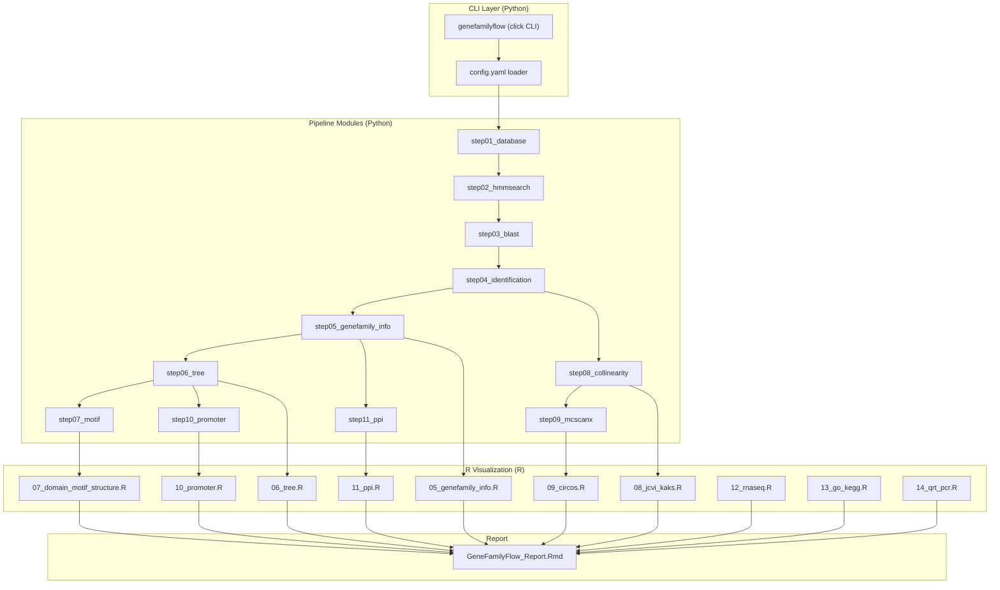

# GeneFamilyFlow Framework Development Plan

## 1. Current State

The repository contains only a minimal `README.md` and an `example/` directory with:

- `[example/GeneFamilyFlow.md](example/GeneFamilyFlow.md)`: 14-step pipeline specification (shell commands)
- `[example/R/](example/R/)`: 17 R scripts for visualization (tree, circos, promoter, PPI, heatmap, GO/KEGG, qRT-PCR)
- `[example/7.motif_genestructure/get_motif_info.py](example/7.motif_genestructure/get_motif_info.py)`: single Python utility
- No project structure, no dependency management, no configuration system

## 2. Architecture Design




## 3. Target Directory Structure

```
GeneFamilyFlow/
├── README.md
├── setup.py
├── environment.yml                  # Conda environment (Python + R + bioinformatics tools)
├── config/
│   └── default_config.yaml          # Default pipeline configuration template
├── genefamilyflow/                  # Python package
│   ├── __init__.py
│   ├── cli.py                       # Click-based CLI entry point
│   ├── config.py                    # YAML config loader + validation
│   ├── utils.py                     # Shared utilities (fasta parsing, ID cleaning, logging)
│   ├── steps/
│   │   ├── __init__.py
│   │   ├── step01_database.py       # Data preparation + longest transcript extraction
│   │   ├── step02_hmmsearch.py      # Two-round HMM search
│   │   ├── step03_blast.py          # BLASTp against reference
│   │   ├── step04_identification.py # Intersection + Pfam validation
│   │   ├── step05_genefamily_info.py # Gene info extraction + bed generation
│   │   ├── step06_tree.py           # MSA (MUSCLE) + tree building (IQ-TREE)
│   │   ├── step07_motif.py          # MEME motif analysis
│   │   ├── step08_collinearity.py   # JCVI synteny + KaKs
│   │   ├── step09_mcscanx.py        # MCScanX + duplicate classification
│   │   ├── step10_promoter.py       # Upstream sequence extraction
│   │   └── step11_ppi.py            # PPI network construction
│   └── r_bindins.py                 # R script invocation wrapper (subprocess)
├── R/                               # Refactored R scripts
│   ├── 05_genefamily_info.R
│   ├── 06_tree.R
│   ├── 07_domain_motif_structure.R
│   ├── 08_jcvi_kaks.R
│   ├── 09_circos.R
│   ├── 10_promoter.R
│   ├── 11_ppi.R
│   ├── 12_rnaseq.R
│   ├── 13_go_kegg.R
│   ├── 14_qrt_pcr.R
│   ├── utils/
│   │   ├── gene_structure_data.R
│   │   ├── get_node_edge.R
│   │   └── clean_ID.R
│   └── report/
│       └── GeneFamilyFlow_Report.Rmd
├── doc/                             # Documentation (plan docs go here)
│   ├── architecture.md
│   ├── pipeline_steps.md
│   └── configuration_guide.md
├── example/                         # Preserved example data (existing)
│   └── ...
└── .gitignore
```

## 4. Pipeline Steps -- Implementation Details

### Step 01: Database Preparation (`step01_database.py`)

- Input: species list + data source paths (Phytozome / 1000 species)
- Validate genome assembly level (chromosome/scaffold, reject contig)
- Parse GFF3/GTF to extract longest/representative transcript per gene
- Output: `{species}.pep.fasta`, `{species}.cds.fasta`, `{species}.gff3` (cleaned)
- Key logic from example: GFF3 parsing, `seqkit` calls, transcript filtering

### Step 02: HMM Search (`step02_hmmsearch.py`)

- Round 1: Download Pfam HMM (configurable PF ID), `hmmsearch --cut_tc` against all species pep
- Filter by E-value (configurable, default 1e-10), extract IDs
- Run ClustalW/MUSCLE alignment on round-1 hits
- `hmmbuild` to create custom HMM
- Round 2: `hmmsearch` with custom HMM, re-filter
- Output: `2st_id` (second-round gene IDs)

### Step 03: BLAST (`step03_blast.py`)

- Build BLAST DB from reference species known family members
- `blastp` all species pep against reference DB (E-value 1e-10)
- Collect hit IDs
- Output: `species.blast.id`

### Step 04: Identification (`step04_identification.py`)

- Intersect hmmsearch + BLAST results
- `hmmscan` / `pfam_scan.pl` for domain validation
- Filter by target Pfam domain
- Output: `identify.ID.fa` (final confirmed family members)

### Step 05: Gene Family Info (`step05_genefamily_info.py` + `05_genefamily_info.R`)

- Python: extract IDs, clean names, generate BED from GFF3
- R: compute physicochemical properties (length, MW, pI, hydrophobicity via `Peptides`), export Excel + boxplots

### Step 06: Phylogenetic Tree (`step06_tree.py` + `06_tree.R`)

- Python: MUSCLE alignment, IQ-TREE (MFP model, 1000 bootstrap)
- R: `ggtree` visualization (circular/rectangular layout), subfamily annotation, clade coloring

### Step 07: Motif & Gene Structure (`step07_motif.py` + `07_domain_motif_structure.R`)

- Python: MEME analysis, parse motif output (reuse existing `get_motif_info.py` logic)
- R: combined tree + domain + motif + gene structure plot using `ggtree` + `gggenes` + `aplot`

### Step 08: JCVI Collinearity (`step08_collinearity.py` + `08_jcvi_kaks.R`)

- Python: prepare BED/PEP for JCVI, run `jcvi.compara.catalog ortholog`, synteny screen, karyotype plotting, KaKs calculation
- R: KaKs boxplot visualization

### Step 09: MCScanX (`step09_mcscanx.py` + `09_circos.R`)

- Python: intra-species BLAST, MCScanX collinearity + `duplicate_gene_classifier`
- R: circos plots per species with `circlize` (gene density, duplication type, synteny links)

### Step 10: Promoter (`step10_promoter.py` + `10_promoter.R`)

- Python: extract upstream 2kb with `seqkit subseq`, prepare for PlantCARE
- R: cis-element heatmap combined with tree

### Step 11: PPI (`step11_ppi.py` + `11_ppi.R`)

- Python: BLAST ortholog mapping to AT, AraNet interaction inference
- R: network visualization with `ggraph` + `tidygraph`

### Additional R-only Steps

- `12_rnaseq.R`: expression heatmap (input: TPM matrix)
- `13_go_kegg.R`: GO/KEGG enrichment with `clusterProfiler`
- `14_qrt_pcr.R`: qRT-PCR barplot with significance letters

## 5. Configuration System (`config/default_config.yaml`)

Key configurable parameters:

- `project_name`, `output_dir`
- `species`: list of `{name, pep_fasta, cds_fasta, gff3, genome_fasta(optional)}`
- `reference_species`: name + known family gene IDs
- `pfam_id`: target Pfam domain (e.g., PF00854)
- `hmmsearch.evalue`, `blast.evalue`, `blast.threads`
- `tree.bootstrap`, `tree.model`
- `meme.nmotifs`, `meme.minw`, `meme.maxw`
- `promoter.upstream_length`
- `kaks.method`
- Colors/species display names for plots

## 6. Environment Management (`environment.yml`)

Conda environment with:

- **Python**: click, pyyaml, biopython, pandas
- **R**: tidyverse, ggtree, treeio, Biostrings, Peptides, circlize, ComplexHeatmap, clusterProfiler, ggraph, pheatmap, gggenes, aplot, patchwork, ggh4x, writexl, readxl
- **Bioinformatics tools**: hmmer, blast, muscle, iqtree, meme, seqkit, jcvi, mcscanx, clustalw

## 7. Documentation (`doc/`)

Three documents to create in `doc/`:

- `**architecture.md`**: project structure, module responsibility, data flow diagram
- `**pipeline_steps.md**`: detailed step-by-step guide with input/output/parameters for each step
- `**configuration_guide.md**`: YAML configuration reference with all parameters explained

## 8. Implementation Priorities

Phase 1 (core infrastructure):

- Project scaffold (directory structure, setup.py, environment.yml, .gitignore)
- Configuration system (config.py + default_config.yaml)
- CLI framework (cli.py with click)
- Utility functions (utils.py)

Phase 2 (pipeline steps 1-4, core identification):

- step01_database through step04_identification
- These form the core gene family identification pipeline

Phase 3 (analysis steps 5-7):

- Gene family info, phylogenetic tree, motif analysis
- Refactor corresponding R scripts to accept config-driven parameters

Phase 4 (synteny and evolution, steps 8-9):

- Collinearity (JCVI + MCScanX) + KaKs
- Circos visualization

Phase 5 (functional analysis, steps 10-11 + R-only):

- Promoter, PPI, RNA-seq, GO/KEGG, qRT-PCR
- Rmarkdown report template

Phase 6 (documentation + polish):

- Write `doc/` documentation files
- Update README.md
- Testing and refinement

